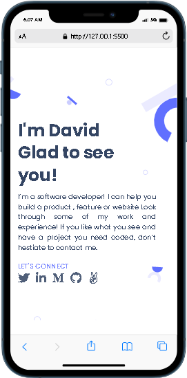
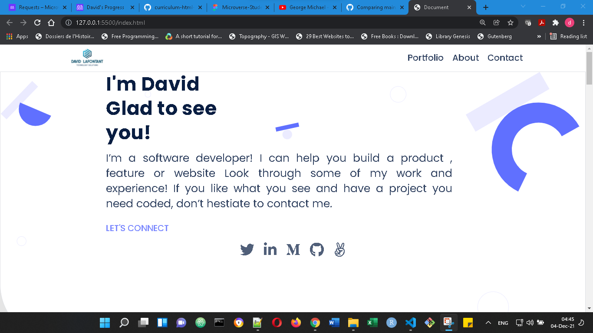

# Project Name

> This project is done as part of the fist 3 weeks activities in Microverse. It is made in order to help the student masters:

- How to parse a Figma design to create a UI.
- Use Flexbox, Grid and Float to place elements in a page.
- Build a personal portfolio site.
- Use images, backgrounds and animations to enhance the look of the website.
- How to deploy a website on Github Pages.
- Add accebility feature
- Create form
- validate form with Javascript

## Mobile version

## Desktop version

Additional description about the project and its features.

## Built With

-HTML
-CSS
-Microverse html/css linter and markdown template
-Google Chrome Mobile simulator extension - [responsive testing tool](https://chrome.google.com/webstore/detail/mobile-simulator-responsi/ckejmhbmlajgoklhgbapkiccekfoccmk/related)
- [Best Buttons Generator](https://www.bestcssbuttongenerator.com/)
- [Borderradius.com](https://border-radius.com/)

## Live Demo

[Live Demo Link](https://david-lafontant.github.io/Portfolio/)

## Getting Started

To get a local copy up and running follow these simple example steps.

### Prerequisites

Verify you install git (if not istall it)
if you want visualize the mobile version on a desktop can can use a mobile simulator, like this Google Chrome extension: [Mobile Simulator - responsive testing tool](https://chrome.google.com/webstore/detail/mobile-simulator-responsi/ckejmhbmlajgoklhgbapkiccekfoccmk/related) or any equivalent.

### Setup

Set up git if needed

### Clone

Clone using the appropriate link from github

## Authors

👤 **Author1**

- GitHub: [@david-lafontant](https://github.com/david-lafontant)

## 🤝 Contributing

Contributions, issues, and feature requests are welcome!

## Show your support

Give a ⭐️ if you like this project!

## Acknowledgments

- Hat tip to :
  The authors/contributors of the Microverse README.md template:
  @nidalaa nidalaa Emilia Andrzejewska
  @davidauza-engineer davidauza-engineer David Auza
  @kethinov kethinov Eric Newport
  @fernandorpm fernandorpm Fernando Marques

- Hat tip also to my learning partner:
  @andres-condezo ANdres Condozo who help me handle Figma
  @Bondok6 Kyrillos Hany for his availability
  @mukhammadrizooff for his help with the animation
  @sumairq for his help
  @eduardosancho for all his contribution during the fourth week of th first module

## 📝 License

This project is [MIT](./MIT.md) licensed.
